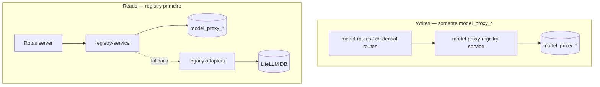

# Batch 3: decisões fechadas (RFC)

> ⚠️ **Este RFC foi formalizado em ADRs individuais.** Cada seção abaixo tem
> um ADR correspondente em `docs/adr/`. Consulte os ADRs para a decisão
> vigente e o bloco VERDADE ATUAL. Este documento mantém-se como registro
> histórico do contexto original.
>
> | Seção | ADR |
> |-------|-----|
> | 1. Estratégia `secret_ref` | [ADR-0001](./adr/0001-secret-ref-upstream-credentials.md) |
> | 2. API keys locais | [ADR-0002](./adr/0002-local-api-keys-model-proxy-api-keys.md) |
> | 3. Settings em `model_proxy_settings` | [ADR-0003](./adr/0003-settings-in-model-proxy-settings.md) |
> | 4. Registry e rename `litellmParams` | [ADR-0004](./adr/0004-model-registry-and-litellmparams-rename.md) |
> | 5. Estados de sync | [ADR-0005](./adr/0005-sync-state-names-rename.md) |
> | 6. Política dual-read / single-write | [ADR-0006](./adr/0006-dual-read-single-write-policy.md) |

> Historical note: this RFC records the Batch 3 decisions as they were made. References
> below to `models.jsonc` are historical and are superseded by spec 0002 / Task-C-0002:
> the current source of truth for operational model routing is the database-backed
> registry in `model_proxy_models` and `model_proxy_providers`.

**Status:** fechado
**Data:** 2026-06-16
**Escopo:** settings, registry e credenciais (`model_proxy_*`)
**Pré-requisitos:** Batch 1 concluído; Batch 2 ledger sem persistir segredos brutos em payloads

Este RFC fixa as decisões de arquitetura para a Onda 0+ do Batch 3. Implementação
detalhada de mapeamento de campos fica em [`batch-3-field-mapping.md`](./batch-3-field-mapping.md)
(SA-0B); import legado em [`batch-3-legacy-import.md`](./batch-3-legacy-import.md)
(SA-0C).

**Schema de referência:** [`repositories/model-proxy-repository/prisma/schema.prisma`](../repositories/model-proxy-repository/prisma/schema.prisma)

---

## 1. Estratégia `secret_ref` (credenciais upstream)

### Decisão

Credenciais upstream novas **não** persistem segredo bruto. O campo canônico de
escrita é `secretRef` (coluna `secret_ref`), contendo **apenas o nome de uma
variável de ambiente** — nunca o valor da chave.

| Campo       | Papel                                  | Writes novos                             |
| ----------- | -------------------------------------- | ---------------------------------------- |
| `secretRef` | Nome da env var (ex. `OPENAI_API_KEY`) | Obrigatório para credencial utilizável   |
| `apiKey`    | Valor bruto legado                     | **Proibido** — rejeitar no service layer |

### Resolução em runtime

Ordem já implementada em `upstream-provider.ts` (mantida):

1. `readSecretRef(row.secretRef)` → `readSecretRef(credential.secretRef)`
2. `credential.apiKey` (somente leitura de dados importados/legados)
3. Provider row / env fallback resolvido a partir do registry

### Formato de `secretRef`

- Valor: string não vazia = **nome exato** da env var (`OPENAI_API_KEY`).
- **Não** usar prefixo `env:` em `secret_ref`.
- Resolução: `process.env[secretRef.trim()]`.

### Import legado (`LiteLLM_CredentialsTable`)

- Registros com `api_key` bruto: adapter converte para `secretRef` quando
  possível (ex. sugere env var derivada do `credential_name`) ou marca para
  rotação manual; **não** regrava `api_key` em updates novos.
- Coluna `api_key` permanece no schema Prisma para leitura transitória; novos
  CRUDs via `credentials.service` ignoram/rejeitam writes nesse campo.

### Configs geradas (`@storage/output`)

Credencial upstream **nunca** aparece em artefatos OpenCode / VS Code /
OpenAgent. Apenas referências indiretas (`env:MODEL_PROXY_API_KEY` para o proxy
local).

---

## 2. API keys locais (`model_proxy_api_keys`)

### Decisão

Chaves que clientes usam para chamar o proxy (`Authorization: Bearer …`) são
distintas de credenciais upstream. Persistência mínima conforme schema Prisma:

| Coluna Prisma             | Campo                   | Regra                                         |
| ------------------------- | ----------------------- | --------------------------------------------- |
| `label`                   | Identificador humano    | Obrigatório; não único                        |
| `keyHash`                 | Hash da chave           | Obrigatório, único; nunca armazenar plaintext |
| `enabled`                 | Ativo/inativo           | Default `true`                                |
| `lastUsedAt`              | Último uso bem-sucedido | Atualizado na validação auth                  |
| `createdAt` / `updatedAt` | Auditoria               | Automáticos                                   |

### Hashing

- Algoritmo: **argon2id** (preferido) ou **bcrypt** com cost ≥ 10.
- Fluxo create: gerar ou receber plaintext **uma vez** na resposta HTTP; persistir
  só `keyHash`.
- Fluxo verify: `argon2.verify` / `bcrypt.compare` contra `keyHash`.

### `MODEL_PROXY_API_KEY` — bootstrap e fallback

| Modo                     | Comportamento                                                                                                             |
| ------------------------ | ------------------------------------------------------------------------------------------------------------------------- |
| **Bootstrap (dev)**      | Se `MODEL_PROXY_API_KEY` está definida e `model_proxy_api_keys` está vazia, auth aceita a env var sem exigir linha no DB. |
| **Seed opcional (boot)** | Script/init pode inserir hash da env key com `label: "env-bootstrap"` para ambientes que exigem só DB.                    |
| **Produção alvo**        | Validar contra `model_proxy_api_keys` (enabled + hash); env como fallback documentado apenas para dev/migração.           |
| **Ordem de auth**        | 1) DB (`keyHash` match + `enabled`) → atualiza `lastUsedAt`; 2) fallback `process.env.MODEL_PROXY_API_KEY`.               |

Comportamento atual (`model-proxy-routes.ts`: só env) será estendido na Onda 3
(SA-3D); esta decisão não altera o runtime até lá.

---

## 3. Settings em `model_proxy_settings`

### Decisão

Substituir usos operacionais de `LiteLLM_Config` por linhas em
`model_proxy_settings` (`key` único, `value` JSON).

| `key`                 | Origem LiteLLM                                                  | Formato `value` (JSON)                                                                                          |
| --------------------- | --------------------------------------------------------------- | --------------------------------------------------------------------------------------------------------------- |
| `default_credential`  | `param_name = 'default_credential'`                             | `{ "default_credential": "<credentialName>" }`                                                                  |
| `health_check_prompt` | `param_name = 'general_settings'` → campo `health_check_prompt` | `{ "health_check_prompt": "<prompt>" }`                                                                         |
| `router_settings`     | `param_name = 'router_settings'`                                | Objeto completo legado, incl. `model_group_alias` e metadados `__lite_llm_analytics.managedModelGroupAliasKeys` |

### Leitura / escrita

- **Writes novos:** apenas `model_proxy_settings` via `settings.service`.
- **Reads:** `model_proxy_settings` primeiro; se ausente, adapter lê
  `LiteLLM_Config` e opcionalmente faz upsert idempotente (import).
- **Delete `default_credential`:** remover linha com `key = 'default_credential'`
  (equivalente ao DELETE legado).

### Metadados de aliases gerenciados

Permanecem **dentro** de `router_settings.value` sob
`__lite_llm_analytics.managedModelGroupAliasKeys`, preservando contrato de
`reconcileManagedAliases` em `router-queries.ts` até refatoração na Onda 3.

---

## 4. Registry de modelos e rename `litellmParams` → `modelRoute`

### Decisão

| Tópico                       | Escolha                                                                   |
| ---------------------------- | ------------------------------------------------------------------------- |
| Fonte primária (dados novos) | `model_proxy_models`                                                      |
| Tipo / API novo              | `modelRoute`                                                              |
| Compat entrada               | API aceita `litellmParams` via shim → normaliza para `modelRoute`         |
| Compat saída                 | Resposta expõe `modelRoute`; `litellmParams` deprecado (alias temporário) |
| Código novo                  | Usa `modelRoute` e `model-route.ts`; adapters isolam legado               |

Colunas Prisma já cobrem o mapeamento (`modelName`, custos, `credentialName`,
`requestOptions`, etc.). Matriz campo-a-campo: SA-0B.

---

## 5. Estados de sync — rename

### Decisão

Abandonar nomenclatura LiteLLM na UI e contratos novos.

| Legado (hoje)       | Novo (Batch 3)       | Significado                                        |
| ------------------- | -------------------- | -------------------------------------------------- |
| `synced`            | `synced`             | Presente e alinhado em registry + dashboard config |
| `config-only`       | `config-only`        | Só no dashboard config legado                      |
| `litellm-only`      | `registry-only`      | Só em `model_proxy_models` (ex-ProxyModelTable)    |
| `config-to-litellm` | `config-to-registry` | Sync: config → registry                            |
| `litellm-to-config` | `registry-to-config` | Sync: registry → config                            |

### Compatibilidade temporária (1 release)

- **Entrada API:** aceitar valores legados; normalizar internamente para os novos.
- **Saída API:** expor apenas nomes novos; opcional header/query `legacySyncNames=1`
  para emitir alias deprecado se necessário para clientes externos.
- **UI:** badges e diálogos usam apenas `registry-only`, `config-to-registry`,
  `registry-to-config`.

Contagens agregadas (`counts`): renomear `litellmOnly` → `registryOnly` no
contrato novo (shim de resposta pode manter ambos até Onda 4).

---

## 6. Política dual-read / single-write

### Decisão

| Operação                      | Destino                                                   | LiteLLM DB                       |
| ----------------------------- | --------------------------------------------------------- | -------------------------------- |
| Create/update/delete settings | `model_proxy_settings`                                    | Read-only via adapter            |
| CRUD modelos registry         | `model_proxy_models`                                      | Read-only via adapter            |
| CRUD credenciais upstream     | `model_proxy_providers` / provider-adjacent registry rows | Read-only via adapter            |
| CRUD API keys locais          | `model_proxy_api_keys`                                    | N/A (não existia em LiteLLM)     |
| Sync batch / import one-shot  | Upsert em `model_proxy_*`                                 | Source read para migração        |
| Analytics / spend             | Sem mudança neste batch                                   | Continua via `analytics-service` |

### Adapters temporários (escopo fechado)

| Adapter                      | Função                                                   |
| ---------------------------- | -------------------------------------------------------- |
| `litellm-params-adapter`     | `litellmParams` ↔ `ModelRoute` ↔ row Prisma              |
| `legacy-config-adapter`      | `LiteLLM_Config` → `model_proxy_settings`                |
| `legacy-credentials-adapter` | `LiteLLM_CredentialsTable` → provider/config no registry |
| `import-legacy-registry`     | `LiteLLM_ProxyModelTable` → `model_proxy_models`         |

`repositories/litellm-repository` **não** é removido neste batch.
Queries em `analytics-service` permanecem; rotas operacionais migram para
registry-service nas Ondas 1–3.

### Risco mitigado

Dual-write registry + LiteLLM **não** ocorre: LiteLLM deixa de receber writes
operacionais novos; apenas leitura e import.

---

## 7. Fora de escopo (confirmado)

- Remover `repositories/litellm-repository`
- Migrar analytics/spend logs (Batch 4)
- UI avançada de rotação de chaves
- Import de histórico completo de spend

---

## 8. Gates para ondas seguintes

| Gate                 | Condição                                                                                                                               |
| -------------------- | -------------------------------------------------------------------------------------------------------------------------------------- |
| Onda 1               | Este RFC + SA-0B field mapping aprovados                                                                                               |
| Onda 3D (auth proxy) | SA-0D fixes ledger (double-finish) com testes verdes                                                                                   |
| Onda 5               | Checklists em [`litellm-removal-batch-3-settings-registry-credentials.md`](./litellm-removal-batch-3-settings-registry-credentials.md) |

---

## Referências

- Plano Batch 3 (ondas SA-0A … SA-5C; ver `.cursor/plans/batch_3_implementation_plan_73d35577.plan.md`)
- [`litellm-removal-batch-3-settings-registry-credentials.md`](./litellm-removal-batch-3-settings-registry-credentials.md)
- [`litellm-removal-migration-plan.md`](./litellm-removal-migration-plan.md) (Fase 2)
- [`litellm-removal-batch-1-foundation.md`](./litellm-removal-batch-1-foundation.md)
- [`litellm-removal-batch-2-ledger.md`](./litellm-removal-batch-2-ledger.md)
