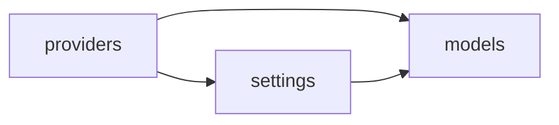

# Batch 3: Legacy One-Shot Import (SA-0C)

> Historical note: this import spec is preserved for migration history. References to
> `models.jsonc` below are historical and superseded by spec 0002 / Task-C-0002: the
> live operational source of truth is now the registry stored in `model_proxy_models`
> and `model_proxy_providers`.

**Status:** specification (implementation in Onda 1+)
**Date:** 2026-06-16
**Scope:** one-shot migration of operational settings, upstream credentials, and model
registry from LiteLLM tables into `model_proxy_*`
**Prerequisites:** Batch 1 schema; Batch 2 ledger without raw secrets in payloads;
[`batch-3-decisions.md`](./batch-3-decisions.md) and
[`batch-3-field-mapping.md`](./batch-3-field-mapping.md) (SA-0B)

This document defines the **read-only source → write target** mapping for the legacy
import adapters named in the Batch 3 RFC:

| Adapter                      | Source                     | Target                                                    |
| ---------------------------- | -------------------------- | --------------------------------------------------------- |
| `legacy-config-adapter`      | `LiteLLM_Config`           | `model_proxy_settings`                                    |
| `legacy-credentials-adapter` | `LiteLLM_CredentialsTable` | `model_proxy_providers` / provider-adjacent registry data |
| `import-legacy-registry`     | `LiteLLM_ProxyModelTable`  | `model_proxy_models`                                      |

The import is **one-shot / idempotent**: safe to re-run; does not dual-write back to
LiteLLM. Analytics (`LiteLLM_SpendLogs`, etc.) stays on the LiteLLM DB until Batch 4.

---

## Environment requirements

Both databases must be reachable at import time.

### Target — `model_proxy_*`

| Variable                   | Required | Notes                                                                                                                                          |
| -------------------------- | -------- | ---------------------------------------------------------------------------------------------------------------------------------------------- |
| `MODEL_PROXY_DATABASE_URL` | **Yes**  | PostgreSQL URL for `@lite-llm/model-proxy-repository`. Schema must be migrated (`pnpm --filter @lite-llm/model-proxy-repository db:validate`). |

### Source — LiteLLM operational tables

| Variable                                                  | Required                            | Notes                                                                                                |
| --------------------------------------------------------- | ----------------------------------- | ---------------------------------------------------------------------------------------------------- |
| `DB_HOST`, `DB_PORT`, `DB_NAME`, `DB_USER`, `DB_PASSWORD` | **Yes** (unless `DATABASE_URL` set) | Used by `@lite-llm/litellm-repository` / `analytics-service` queries.                                |
| `DATABASE_URL`                                            | Optional override                   | Full PostgreSQL URL; takes precedence over discrete `DB_*` vars (see `getBackupDatabaseUrlFromEnv`). |

The two databases may be the **same PostgreSQL instance** (different schemas) or
**separate instances** — the import script opens two clients and does not assume
colocation.

### Runtime env vars (after import)

Import **does not** inject secrets into the process environment. Operators must
configure env vars **before** the model proxy can resolve upstream credentials
(see [Post-import credential env vars](#post-import-credential-env-vars)).

| Variable                                    | When needed                                                                   |
| ------------------------------------------- | ----------------------------------------------------------------------------- |
| Per-provider / per-model `secretRef` values | **Required** for production upstream auth after import                        |
| `MODEL_PROXY_API_KEY`                       | Local proxy client auth (unrelated to upstream credentials; see decisions §2) |

---

## Planned CLI

Implementation target: a script or `pnpm` task (e.g.
`pnpm --filter @lite-llm/model-proxy-config-service import:legacy`) that:

1. Creates a row in `model_proxy_import_jobs` (`source = "litellm-operational"`,
   `status = "running"`).
2. Runs the three import phases in order (see below).
3. Writes a `summary` JSON (`inserted`, `updated`, `skipped`, `errors`) and sets
   `status = "completed"` or `"failed"`.

| Flag        | Default | Behavior                                                                         |
| ----------- | ------- | -------------------------------------------------------------------------------- |
| `--dry-run` | off     | Log actions; no writes to `model_proxy_*`                                        |
| `--force`   | off     | Overwrite existing rows matched by natural key (see [Idempotency](#idempotency)) |
| `--only`    | all     | Restrict to `settings`, `providers`, or `models`                                 |

Without `--force`, rows that already exist in the target (by natural key) are
**skipped** and counted in `summary.skipped`.

---

## Import order

Foreign references are by **name**, not FK. Recommended phase order:

1. **Providers** — `model_proxy_models.provider_name` and provider resolution
   defaults reference provider **names**.
2. **Settings** — `default_credential`, `health_check_prompt`, `router_settings`.
3. **Models** — registry rows can then reference provider names already present.

---

## 1. `LiteLLM_Config` → `model_proxy_settings`

**Source table:** `LiteLLM_Config` (`param_name` PK, `param_value` JSONB)
**Target table:** `model_proxy_settings` (`key` unique, `value` JSONB)
**Natural key:** `model_proxy_settings.key`

Current read paths (analytics-service):

| Setting             | Query file                         | LiteLLM read                                                          |
| ------------------- | ---------------------------------- | --------------------------------------------------------------------- |
| Default credential  | `credential-settings-queries.ts`   | `param_name = 'default_credential'`                                   |
| Health-check prompt | `health-check-settings-queries.ts` | `param_name = 'general_settings'` → `param_value.health_check_prompt` |
| Router settings     | `router-queries.ts`                | `param_name = 'router_settings'` → full `param_value`                 |

### 1.1 `default_credential`

| Source                                             | Target                                            |
| -------------------------------------------------- | ------------------------------------------------- |
| `LiteLLM_Config.param_name = 'default_credential'` | `model_proxy_settings.key = 'default_credential'` |
| `param_value.default_credential` (string)          | `value = { "default_credential": "<name>" }`      |

**Absent source row:** skip (no delete of target). Deleting the default credential
in the new system is a separate CRUD operation (remove row with
`key = 'default_credential'`).

### 1.2 `health_check_prompt`

| Source                                              | Target                                             |
| --------------------------------------------------- | -------------------------------------------------- |
| `LiteLLM_Config.param_name = 'general_settings'`    | `model_proxy_settings.key = 'health_check_prompt'` |
| `param_value.health_check_prompt` (string, trimmed) | `value = { "health_check_prompt": "<prompt>" }`    |

**Extraction** mirrors `getHealthCheckPrompt()`:

- Ignore row if `param_value` is not an object.
- Ignore if `health_check_prompt` is missing, not a string, or empty after trim.
- Do **not** copy unrelated `general_settings` fields (`ui_access_mode`,
  `health_check_interval`, etc.) into `model_proxy_settings`.

### 1.3 `router_settings`

| Source                                          | Target                                         |
| ----------------------------------------------- | ---------------------------------------------- |
| `LiteLLM_Config.param_name = 'router_settings'` | `model_proxy_settings.key = 'router_settings'` |
| Entire `param_value` object                     | `value` = same object (deep copy)              |

**Must preserve:**

- `model_group_alias` map (alias → target model name).
- `__lite_llm_analytics.managedModelGroupAliasKeys` array — used by
  `reconcileManagedAliases` in `router-queries.ts` / `updateRouterSettings`.

No transformation beyond JSON round-trip. Future registry code reads/writes this
blob via `settings.service`; LiteLLM_Config becomes read-only for migration
fallback only.

---

## 2. Legacy provider/config import → registry provider rows

**Source table:** `LiteLLM_CredentialsTable` plus provider hints carried in legacy config
**Target table:** `model_proxy_providers` (and related registry metadata)
**Natural key:** provider `name`

Current read path: `getAllCredentials()` in `key-queries.ts` (full table scan,
ordered by `credential_name`).

### Field mapping

| LiteLLM column / JSON path            | Target column                    | Import rule                                                 |
| ------------------------------------- | -------------------------------- | ----------------------------------------------------------- |
| `credential_info.custom_llm_provider` | `name`                           | Prefer explicit provider hint when present                  |
| `credential_values.api_base`          | `base_url`                       | String or null                                              |
| `credential_values.api_key`           | `secret_ref` or env handoff note | See [secret_ref policy](#secret_ref-policy)                 |
| `credential_name`                     | metadata / summary only          | Credential labels may still be noted for operator follow-up |

Other keys inside `credential_values` (e.g. `api_version`, provider-specific
fields) are **not** persisted in Batch 3 MVP unless added to the Prisma schema
later. Log `summary.warnings` for unexpected keys.

### `secret_ref` policy

Aligned with [`batch-3-decisions.md`](./batch-3-decisions.md) §1:

| Rule                                                    | Detail                                                                                                                |
| ------------------------------------------------------- | --------------------------------------------------------------------------------------------------------------------- |
| **New writes after import**                             | Service layer rejects raw `apiKey` on create/update                                                                   |
| **Import-time handling of `credential_values.api_key`** | Never copy plaintext into logs or `model_proxy_import_jobs.summary`                                                   |
| **Preferred outcome**                                   | Set `secret_ref` to a derived env var name; leave raw secret material outside the database rows written by the import |
| **No re-write on `--force`**                            | `--force` updates provider metadata and `secret_ref`; still **must not** write new plaintext into persisted rows      |

#### Deriving `secret_ref`

When legacy source material implies a provider API key:

1. Normalize the provider/credential name: uppercase, non-alphanumeric → `_`, collapse repeats.
2. Append `_API_KEY` if the result does not already end with `_API_KEY`.
3. Set `secret_ref` to that string.
4. Add to job summary `requiredEnvVars`: `{ "provider": "<name>", "secretRef": "<VAR>", "action": "set env var before proxy start" }`.

The import script **must not** print secret values.

---

## 3. `LiteLLM_ProxyModelTable` → `model_proxy_models`

**Source table:** `LiteLLM_ProxyModelTable`
**Target table:** `model_proxy_models`
**Natural key:** `model_name` or `(model_name, provider_name)` when provider-scoped routing is enabled

Current read paths: `getAllModels()`, `getModelDetails()`, CRUD in
`model-queries.ts`.

### Row-level mapping

| LiteLLM                     | Target                            | Notes                                                |
| --------------------------- | --------------------------------- | ---------------------------------------------------- |
| `model_name`                | `model_name`                      | Upsert key                                           |
| `litellm_params`            | typed columns + `request_options` | Via SA-0B `litellmParams` → `toModelProxyRow`        |
| `model_id`                  | —                                 | New `id` (`cuid()`); legacy UUID not preserved       |
| `model_info`                | —                                 | Not imported (metadata / access groups out of scope) |
| `created_by` / `updated_by` | —                                 | Dropped                                              |

### `litellm_params` → columns

Apply conversion rules from [`batch-3-field-mapping.md`](./batch-3-field-mapping.md):

| `litellm_params` key                      | `model_proxy_models` column |
| ----------------------------------------- | --------------------------- |
| `model` / `model_name`                    | `model_name`                |
| `enabled`                                 | `enabled` (default `true`)  |
| `input_cost_per_token`                    | `input_cost_per_token`      |
| `output_cost_per_token`                   | `output_cost_per_token`     |
| `context_window_size`                     | `context_window_size`       |
| `max_tokens`                              | `max_output_tokens`         |
| `provider_name` / `litellm_provider_name` | `provider_name`             |
| `api_base`                                | `upstream_base_url`         |
| `custom_llm_provider`                     | `owned_by` and/or `family`  |
| `model` (upstream id ≠ alias)             | `upstream_model`            |
| All other keys                            | `request_options` JSON      |

**Display / config-adjacent fields** (`display_name`, `api_mode`, `vision`) may
still be synchronized for compatibility payloads later, but import is centered
on registry rows, not a file-backed model catalog.

### Duplicate `model_name` in LiteLLM

`LiteLLM_ProxyModelTable` has no unique constraint on `model_name` in all
deployments. Import should:

- Process rows ordered by `updated_at DESC`.
- Keep the first row per natural key; log duplicates as warnings.

---

## Idempotency

| Target table            | Natural key | Default re-import  | With `--force`                                              |
| ----------------------- | ----------- | ------------------ | ----------------------------------------------------------- |
| `model_proxy_settings`  | `key`       | Skip if row exists | `UPDATE value` (+ `updated_at`) from LiteLLM source         |
| `model_proxy_providers` | `name`      | Skip if row exists | Update provider metadata and `secret_ref` per policy        |
| `model_proxy_models`    | natural key | Skip if row exists | Full column refresh from latest `litellm_params` conversion |

**Upsert semantics:** implement as `findUnique` on natural key → insert or skip/update.
Use a single transaction per phase optional; partial completion is recorded in
`model_proxy_import_jobs.summary`.

**LiteLLM source:** always read-only. Import never executes the write paths in
`credential-settings-queries.ts`, `router-queries.ts`, or `model-queries.ts`
against LiteLLM.

---

## Post-import credential env vars

After a successful import, upstream requests resolve provider/model secrets in this order:

1. `model_proxy_models.secret_ref` → `process.env[secretRef]`
2. `model_proxy_providers.secret_ref` → `process.env[secretRef]`

### Checklist for operators

1. Read `model_proxy_import_jobs.summary.requiredEnvVars`.
2. For each `secret_ref`, set the corresponding env var in the deployment environment.
3. Restart model proxy / server processes so `process.env` is reloaded.
4. Run a health-check or single chat completion against each provider alias.

---

## Out of scope (this import)

- `LiteLLM_SpendLogs` / analytics history (Batch 4)
- `LiteLLM_AgentsTable`, verification tokens, budgets
- `model_proxy_api_keys` (local proxy keys — separate bootstrap; see decisions §2)
- `model_proxy_aliases` as a separate table (aliases remain inside
  `router_settings.value.model_group_alias` for Batch 3)
- Writing back to any LiteLLM table

---

## References

- Decisions: [`batch-3-decisions.md`](./batch-3-decisions.md)
- Field matrix: [`batch-3-field-mapping.md`](./batch-3-field-mapping.md)
- Prisma target schema:
  [`repositories/model-proxy-repository/prisma/schema.prisma`](../repositories/model-proxy-repository/prisma/schema.prisma)
- Source queries:
  - [`credential-settings-queries.ts`](../services/analytics-service/src/queries/credential-settings-queries.ts)
  - [`health-check-settings-queries.ts`](../services/analytics-service/src/queries/health-check-settings-queries.ts)
  - [`router-queries.ts`](../services/analytics-service/src/queries/router-queries.ts)
  - [`model-queries.ts`](../services/analytics-service/src/queries/model-queries.ts)
  - [`key-queries.ts`](../services/analytics-service/src/queries/key-queries.ts)
- Upstream resolution:
  [`upstream-provider.ts`](../services/llm-gateway/src/resolver/upstream-provider.ts)
- Batch 3 checklist:
  [`litellm-removal-batch-3-settings-registry-credentials.md`](./litellm-removal-batch-3-settings-registry-credentials.md)
