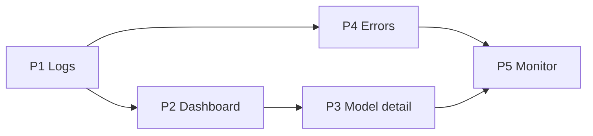

# Batch 4: Query priority — `AnalyticsDataSource` methods

Classificação dos **48 métodos** de
[`AnalyticsDataSource`](../services/analytics-service/src/types/index.ts) para
migração LiteLLM → `model_proxy_requests`. Inventário SQL legado:
[`litellm-query-inventory.md`](./litellm-query-inventory.md).

**Legenda**

| Símbolo | Significado |
|---------|-------------|
| **P1** | Logs — Onda 1 (`getSpendLogs*`) |
| **P2** | Dashboard principal — Onda 2 |
| **P3** | Model detail — Onda 3 |
| **P4** | Errors — Onda 3 |
| **P5** | Monitor — Onda 3 + validação Onda 6 |
| **REG** | Delega ao registry/settings (Batch 3); sem query spend |
| **NOOP** | Retorna vazio em `model-proxy`; breaking change documentado |
| **AGENT** | Agents-manager; fora do escopo analytics Batch 4 |
| **MUT** | Mutação em `model_proxy_requests` (merge/delete logs) |

---

## Resumo por tier

| Tier | Onda | Count | Métodos |
|------|------|-------|---------|
| P1 Logs | 1 | 3 | `getSpendLogs`, `getSpendLogsCount`, `getSpendLogDetail` |
| P2 Dashboard | 2 | 11 | métricas, trends, distribuições (exc. user/key) |
| P3 Model detail | 3 | 12 | trends/latência/TTFT/status/provider por modelo |
| P4 Errors | 3 | 2 | `getErrorLogs`, (+ inline em monitor) |
| P5 Monitor | 3/6 | 5 | `getErrorsSince`, contagens, health, stuck |
| NOOP | 2 | 5 | agregações user/api_key |
| REG | — | 8 | model CRUD read + credentials/settings |
| AGENT | — | 2 | agent routing config |
| MUT | 3 | 2 | `mergeModels`, `deleteModelLogs` |

---

## P1 — Logs (prioridade máxima)

| Método | Proxy target | Onda | Notas |
|--------|--------------|------|-------|
| `getSpendLogs` | `queries/proxy/spend-queries.ts` | 1 | Filtros: `model`, `startDate`, `endDate`; remover filtro `user` |
| `getSpendLogsCount` | idem | 1 | Mesmos filtros |
| `getSpendLogDetail` | idem | 1 | Por `id`; incluir `messages` relation |

**Presenter:** `ProxyRequestLog` (SA-1C). Sem mapper para `SpendLogEntry` legado.

---

## P2 — Dashboard principal

| Método | Proxy file (planejado) | Onda | Notas |
|--------|------------------------|------|-------|
| `getMetricsSummary` | `proxy/analytics-queries.ts` | 2 | `total_cost`, tokens, `error_count` via `status` |
| `getPerformanceMetrics` | `proxy/analytics-queries.ts` | 2 | `latency_ms`, success rate |
| `getCostEfficiency` | `proxy/analytics-queries.ts` | 2 | Por `model` |
| `getDailySpendTrend` | `proxy/trend-queries.ts` | 2 | `total_cost` |
| `getHourlySpendTrend` | `proxy/trend-queries.ts` | 2 | |
| `getDailyTokenTrend` | `proxy/trend-queries.ts` | 2 | `input_tokens` / `output_tokens` |
| `getHourlyUsagePatterns` | `proxy/trend-queries.ts` | 2 | |
| `getSpendByModel` | `proxy/distribution-queries.ts` | 2 | |
| `getTokenDistribution` | `proxy/distribution-queries.ts` | 2 | |
| `getModelDistribution` | `proxy/distribution-queries.ts` | 2 | Request counts |
| `getModelStatistics` | `proxy/model-queries.ts` | 2–3 | `unique_users` / `unique_api_keys` → `0` |

---

## P2 — NOOP (breaking change)

Retornam **`[]`** (ou estrutura vazia equivalente) em `ModelProxyDataSource`.
UI oculta widgets (Onda 4). Ver [`batch-4-decisions.md`](./batch-4-decisions.md) §5.

| Método | Motivo | Onda doc |
|--------|--------|----------|
| `getSpendByUser` | Sem coluna `user` | 2 |
| `getSpendByKey` | Sem coluna `api_key` | 2 |
| `getApiKeyStats` | Sem coluna `api_key` | 2 |
| `getTopUsersByModel` | Sem coluna `user` | 3 |
| `getTopApiKeysByModel` | Sem coluna `api_key` | 3 |

---

## P3 — Model detail

| Método | Proxy file | Onda | Notas |
|--------|------------|------|-------|
| `getDailySpendTrendByModel` | `proxy/model-queries.ts` | 3 | |
| `getDailyTokenTrendByModel` | `proxy/model-queries.ts` | 3 | |
| `getHourlyUsageByModel` | `proxy/model-queries.ts` | 3 | |
| `getDailyLatencyTrendByModel` | `proxy/model-queries.ts` | 3 | Percentis sobre `latency_ms` |
| `getErrorBreakdownByModel` | `proxy/model-queries.ts` | 3 | `error_type` |
| `getDailyErrorTrendByModel` | `proxy/model-queries.ts` | 3 | |
| `getCacheHitRateByModel` | `proxy/model-queries.ts` | 3 | `SUM(cached_tokens)/SUM(input_tokens)` |
| `getTTFTPercentilesByModel` | `proxy/model-queries.ts` | 3 | Coluna `ttft_ms` |
| `getStatusDistributionByModel` | `proxy/model-queries.ts` | 3 | Valores nativos proxy |
| `getProviderBreakdownByModel` | `proxy/model-queries.ts` | 3 | Por `upstream_base_url` ou registry `owned_by` |

---

## P4 — Errors (lista / painel)

| Método | Proxy file | Onda | Notas |
|--------|------------|------|-------|
| `getErrorLogs` | `proxy/error-queries.ts` | 3 | `status IN ('failed','timeout')` + `error_*`; sem JOIN ErrorLogs |

`getErrorLogDetail` não existe na interface; detalhe via `getSpendLogDetail`.

---

## P5 — Monitor (anomaly detection)

Usados por [`packages/monitor`](../packages/monitor/). Onda 3 implementa; Onda 6
valida com `ANALYTICS_DATA_SOURCE=model-proxy`.

| Método | Proxy file | Onda | Notas |
|--------|------------|------|-------|
| `getErrorsSince` | `proxy/monitor-queries.ts` | 3 | Substitui JOIN ErrorLogs |
| `getErrorCountByModelSince` | `proxy/monitor-queries.ts` | 3 | |
| `getNonSuccessCountByModelSince` | `proxy/monitor-queries.ts` | 3 | Inclui `failed`, `timeout`, `cancelled` |
| `getModelHealthSince` | `proxy/monitor-queries.ts` | 3 | Latência + success/error counts |
| `getStuckRequests` | `proxy/monitor-queries.ts` | 3 | `status = 'started' AND started_at < now() - interval` |

---

## REG — Registry / settings (Batch 3)

Sem reimplementação em `queries/proxy/`. `DatabaseDataSource` e
`ModelProxyDataSource` delegam ao **mesmo** registry-service.

| Método | Destino Batch 3 | Tabela / service |
|--------|-----------------|------------------|
| `getModels` | registry | `model_proxy_models` |
| `getModelDetails` | registry | `model_proxy_models` + costs |
| `createModel` | registry | `model_proxy_models` |
| `updateModel` | registry | `model_proxy_models` |
| `deleteModel` | registry | `model_proxy_models` |
| `getCredentials` | registry | `model_proxy_credentials` |
| `getDefaultCredential` | settings | `model_proxy_settings` key `default_credential` |
| `getHealthCheckPrompt` | settings | `model_proxy_settings` key `health_check_prompt` |
| `setDefaultCredential` | settings | `model_proxy_settings` |

---

## AGENT — Fora do escopo Batch 4

| Método | Pacote |
|--------|--------|
| `getAgentRoutingConfig` | `@lite-llm/agents-manager` |
| `updateAgentRoutingConfig` | `@lite-llm/agents-manager` |

---

## MUT — Mutações de logs

| Método | Operação proxy | Onda |
|--------|----------------|------|
| `mergeModels` | `UPDATE model_proxy_requests SET model = $target WHERE model = $source` | 3 |
| `deleteModelLogs` | `DELETE FROM model_proxy_requests WHERE model = $name` (+ cascade messages) | 3 |

---

## Matriz completa (48 métodos)

| # | Método | Tier | Proxy / destino |
|---|--------|------|-----------------|
| 1 | `getMetricsSummary` | P2 | proxy/analytics-queries |
| 2 | `getDailySpendTrend` | P2 | proxy/trend-queries |
| 3 | `getHourlySpendTrend` | P2 | proxy/trend-queries |
| 4 | `getSpendByModel` | P2 | proxy/distribution-queries |
| 5 | `getSpendByUser` | **NOOP** | `[]` |
| 6 | `getSpendByKey` | **NOOP** | `[]` |
| 7 | `getSpendLogs` | P1 | proxy/spend-queries |
| 8 | `getSpendLogsCount` | P1 | proxy/spend-queries |
| 9 | `getSpendLogDetail` | P1 | proxy/spend-queries |
| 10 | `getTokenDistribution` | P2 | proxy/distribution-queries |
| 11 | `getPerformanceMetrics` | P2 | proxy/analytics-queries |
| 12 | `getHourlyUsagePatterns` | P2 | proxy/trend-queries |
| 13 | `getApiKeyStats` | **NOOP** | `[]` |
| 14 | `getCostEfficiency` | P2 | proxy/analytics-queries |
| 15 | `getModelDistribution` | P2 | proxy/distribution-queries |
| 16 | `getDailyTokenTrend` | P2 | proxy/trend-queries |
| 17 | `getModelStatistics` | P2/P3 | proxy/model-queries |
| 18 | `getDailySpendTrendByModel` | P3 | proxy/model-queries |
| 19 | `getDailyTokenTrendByModel` | P3 | proxy/model-queries |
| 20 | `getHourlyUsageByModel` | P3 | proxy/model-queries |
| 21 | `getDailyLatencyTrendByModel` | P3 | proxy/model-queries |
| 22 | `getErrorBreakdownByModel` | P3 | proxy/model-queries |
| 23 | `getDailyErrorTrendByModel` | P3 | proxy/model-queries |
| 24 | `getModels` | **REG** | registry-service |
| 25 | `getModelDetails` | **REG** | registry-service |
| 26 | `getErrorLogs` | P4 | proxy/error-queries |
| 27 | `createModel` | **REG** | registry-service |
| 28 | `updateModel` | **REG** | registry-service |
| 29 | `deleteModel` | **REG** | registry-service |
| 30 | `mergeModels` | **MUT** | proxy/model-queries |
| 31 | `deleteModelLogs` | **MUT** | proxy/model-queries |
| 32 | `getAgentRoutingConfig` | **AGENT** | agents-manager |
| 33 | `updateAgentRoutingConfig` | **AGENT** | agents-manager |
| 34 | `getTopUsersByModel` | **NOOP** | `[]` |
| 35 | `getTopApiKeysByModel` | **NOOP** | `[]` |
| 36 | `getErrorsSince` | P5 | proxy/monitor-queries |
| 37 | `getErrorCountByModelSince` | P5 | proxy/monitor-queries |
| 38 | `getNonSuccessCountByModelSince` | P5 | proxy/monitor-queries |
| 39 | `getModelHealthSince` | P5 | proxy/monitor-queries |
| 40 | `getStuckRequests` | P5 | proxy/monitor-queries |
| 41 | `getCacheHitRateByModel` | P3 | proxy/model-queries |
| 42 | `getTTFTPercentilesByModel` | P3 | proxy/model-queries |
| 43 | `getStatusDistributionByModel` | P3 | proxy/model-queries |
| 44 | `getProviderBreakdownByModel` | P3 | proxy/model-queries |
| 45 | `getCredentials` | **REG** | registry-service |
| 46 | `getDefaultCredential` | **REG** | settings-service |
| 47 | `getHealthCheckPrompt` | **REG** | settings-service |
| 48 | `setDefaultCredential` | **REG** | settings-service |

---

## Ordem de implementação recomendada

NOOP e REG podem ser wired no skeleton da Onda 1 (stubs). MUT na Onda 3.

---

## Referências

- [`batch-4-decisions.md`](./batch-4-decisions.md)
- [`batch-4-field-mapping.md`](./batch-4-field-mapping.md)
- [`litellm-removal-batch-4-analytics-history.md`](./litellm-removal-batch-4-analytics-history.md)
- Plano: `.cursor/plans/batch_4_analytics_plan_f3e26003.plan.md`
