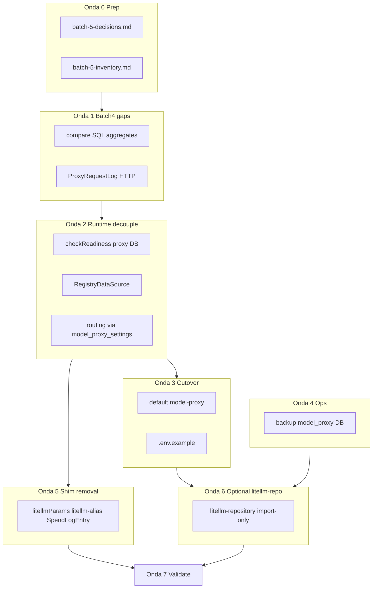

# Plano Batch 5 — consumidores e remoção final

## Contexto

O [Batch 5](docs/litellm-removal-batch-5-consumers-removal.md) fecha a migração: `pnpm dev` sem PostgreSQL LiteLLM, nomenclatura `model-proxy` em runtime, backup no banco novo, docs/env alinhados. **~70% dos consumidores já foram entregues no Batch 1** (health-check, prompt-eval, plugins, `local-proxy`, `model-alias`).

**Política confirmada:** cutover **duro** — default `ANALYTICS_DATA_SOURCE=model-proxy`; API expõe só `ProxyRequestLog` / `modelRoute`; remove `litellmParams`, `litellm-alias` e `SpendLogEntry` das rotas; modos `litellm` / `hybrid` ficam apenas para CLIs de import/compare.

**Pré-requisito implícito:** corrigir 3 bloqueios da revisão do Batch 4 antes do gate de validação:
- compare/hybrid limitado a 1000 rows ([`spend-queries.ts`](services/analytics-service/src/queries/proxy/spend-queries.ts) `limit === 0 → 1000`)
- API ainda serializa `SpendLogEntry` via [`proxy-spend-methods.ts`](services/analytics-service/src/data-source/proxy-spend-methods.ts)
- REG/routing ainda no LiteLLM DB ([`model-proxy.ts:49-77`](services/analytics-service/src/data-source/model-proxy.ts), [`routing-methods.ts`](services/analytics-service/src/data-source/routing-methods.ts), [`health-check-settings-queries.ts`](services/analytics-service/src/queries/health-check-settings-queries.ts))



---

## Onda 0 — Preparação (paralelo, sem dependências)

| ID | Subagent | Entregável |
|----|----------|------------|
| SA-0A | RFC | [`docs/batch-5-decisions.md`](docs/batch-5-decisions.md) — cutover duro, janela de adapters (import/compare offline), remoção de shims, default env, critérios de pronto |
| SA-0B | Inventário | [`docs/batch-5-inventory.md`](docs/batch-5-inventory.md) — `LITELLM_*` restantes, deps `@lite-llm/litellm-repository`, arquivos `@storage/output`, docs/scripts runtime vs histórico |
| SA-0C | Gap audit | Atualizar status em [`litellm-removal-batch-5-consumers-removal.md`](docs/litellm-removal-batch-5-consumers-removal.md) prep checklist + link para este plano |

**Paralelismo:** 3 subagents independentes.

---

## Onda 1 — Fechar gaps Batch 4 (paralelo, após Onda 0)

| ID | Subagent | Entregável |
|----|----------|------------|
| SA-1A | Compare fix | Queries `SUM`/`COUNT` em [`services/analytics-service/src/queries/proxy/`](services/analytics-service/src/queries/proxy/) + espelho LiteLLM; refatorar [`compareTotals`](services/analytics-service/src/data-source/hybrid.ts) e [`compare-analytics-sources`](scripts/src/compare-analytics-sources/index.ts) para não depender de `limit: 0` |
| SA-1B | API nativa | Remover `proxyRequestLogToSpendLogEntry`; rotas [`spend-routes.ts`](packages/server/src/routes/spend-routes.ts) retornam `ProxyRequestLog`; atualizar tipos em [`AnalyticsDataSource`](services/analytics-service/src/types/index.ts) métodos P1 |
| SA-1C | Web align | [`apps/web/src/shared/lib/api-client/spend.ts`](apps/web/src/shared/lib/api-client/spend.ts) — consumir resposta nativa sem normalização legada excessiva; badges `usage_estimated` / `cost_estimated` funcionais |
| SA-1D | Testes | Testes compare sem teto 1000; teste contrato HTTP ProxyRequestLog; atualizar mocks server (`registry-integration`, `spend-logs-watcher`) |

**Paralelismo:** SA-1A ∥ SA-1B (independentes); SA-1C após SA-1B; SA-1D após 1A+1B.

---

## Onda 2 — Desacoplar runtime do LiteLLM DB (paralelo, após Onda 1)

| ID | Subagent | Entregável |
|----|----------|------------|
| SA-2A | Readiness | [`analytics-context.ts`](apps/server/src/contexts/analytics-context.ts) — `checkReadiness()` usa `getModelProxyPrisma()` quando `model-proxy`; remover import direto de litellm `prisma` em [`app-runtime.ts`](apps/server/src/runtime/app-runtime.ts) shutdown |
| SA-2B | Registry delegate | Novo `RegistryDataSource` (ou métodos em `model-proxy-registry-service`) para `getModels`, `getCredentials`, `getDefaultCredential`, `getHealthCheckPrompt`, `setDefaultCredential`; substituir `registryDelegate = new DatabaseDataSource()` em [`model-proxy.ts`](services/analytics-service/src/data-source/model-proxy.ts) |
| SA-2C | Routing | [`routing-methods.ts`](services/analytics-service/src/data-source/routing-methods.ts) — ler/escrever `model_proxy_settings` via registry (Batch 3 `router_settings`), não `LiteLLM_Config` |
| SA-2D | Hybrid REG | [`hybrid.ts`](services/analytics-service/src/data-source/hybrid.ts) — delegar REG ao proxy/registry, não LiteLLM |
| SA-2E | Testes | Testes unitários registry delegate + routing sem mock LiteLLM |

**Paralelismo:** SA-2A ∥ SA-2B ∥ SA-2C; SA-2D após 2B; SA-2E após 2B–2D.

---

## Onda 3 — Cutover default e env (sequencial, após Onda 2)

| ID | Subagent | Entregável |
|----|----------|------------|
| SA-3A | Default | [`packages/config/src/server.ts`](packages/config/src/server.ts) — `ANALYTICS_DATA_SOURCE` default `"model-proxy"` |
| SA-3B | Env example | [`.env.example`](.env.example) — `MODEL_PROXY_*`, `MODEL_PROXY_DATABASE_URL`, remover `LITELLM_API_*`; DB vars documentadas como proxy (ou só `MODEL_PROXY_DATABASE_URL`) |
| SA-3C | Server tests | Atualizar stubs de teste que assumem `DB_NAME=litellm` como obrigatório ([`model-proxy-routes.test.ts`](apps/server/src/__tests__/model-proxy-routes.test.ts)) |

---

## Onda 4 — Backup e scripts operacionais (paralelo, pode iniciar após Onda 0)

| ID | Subagent | Entregável |
|----|----------|------------|
| SA-4A | Backup | Renomear/refatorar [`scripts/src/litellm-backup/`](scripts/src/litellm-backup/) → `model-proxy-backup/`; URL de [`getBackupDatabaseUrlFromEnv`](packages/config/src/server.ts) prioriza `MODEL_PROXY_DATABASE_URL`; prefixo arquivo `model_proxy_*` em vez de `litellm_*` |
| SA-4B | Scripts root | [`package.json`](package.json) — `pnpm backup` / `backup:list` apontam para novo script; manter alias `backup:litellm` opcional só para import histórico |
| SA-4C | Docs scripts | Marcar [`sync:cloud`](scripts/src/sync-cloud-litellm/index.ts), `model-proxy:import-*` como **offline/histórico** em batch-5-inventory; `LITELLM_CLOUD_*` permanece só nesses CLIs |

**Paralelismo:** SA-4A ∥ SA-4C; SA-4B após 4A.

---

## Onda 5 — Remoção de shims e nomenclatura (paralelo, após Ondas 1+2)

| ID | Subagent | Entregável |
|----|----------|------------|
| SA-5A | Model API | [`model-routes.ts`](packages/server/src/routes/model-routes.ts) — respostas só `modelRoute`; remover shim `litellmParams` em writes (aceitar só como erro 400 ou one-release 410); limpar [`registry-models-bridge.ts`](packages/server/src/orchestration/registry-models-bridge.ts) |
| SA-5B | Plugin shim | Remover `litellm-alias` → `model-alias` em [`plugin-routing-routes.ts`](packages/server/src/routes/plugin-routing-routes.ts) |
| SA-5C | Types cleanup | Deprecar/remover `SpendLogEntry` export público; [`lite-llm-params.ts`](packages/server/src/orchestration/lite-llm-params.ts) → mover lógica restante para `model-route.ts` ou deletar |
| SA-5D | Web cleanup | Remover colunas Users/API Keys em model-stats quando NOOP; headers deprecated opcionais em rotas user aggregation |
| SA-5E | Generated configs | Documentar/registrar passo `pnpm generate:plugin-configs` para `@storage/output` (gitignored); validar `local-proxy` + `MODEL_PROXY_API_KEY` |

**Paralelismo:** SA-5A ∥ SA-5B ∥ SA-5C; SA-5D após 5A; SA-5E independente.

---

## Onda 6 — `litellm-repository` opcional (paralelo, após Ondas 3+4)

| ID | Subagent | Entregável |
|----|----------|------------|
| SA-6A | Analytics split | `DatabaseDataSource` + `queries/client.ts` litellm só carregados quando `ANALYTICS_DATA_SOURCE=litellm|hybrid`; `model-proxy` path sem dep runtime de `@lite-llm/litellm-repository` |
| SA-6B | Registry import | [`model-proxy-registry-service`](services/model-proxy-registry-service/package.json) — `litellm-repository` como `devDependency` (import adapters only) |
| SA-6C | Knip/turbo | Verificar grafo `pnpm dev` não puxa litellm-repository; atualizar [`AGENTS.md`](AGENTS.md) commands (backup, env, optional litellm) |
| SA-6D | Skill/docs | Marcar [`.agents/skills/lite-llm-db-access`](.agents/skills/lite-llm-db-access/) como histórico/import-only |

---

## Onda 7 — Validação e fechamento (paralelo final)

| ID | Subagent | Entregável |
|----|----------|------------|
| SA-7A | README | [`README.md`](README.md) — remover LiteLLM como runtime; documentar model proxy, `MODEL_PROXY_*`, `ANALYTICS_DATA_SOURCE` |
| SA-7B | Checklists | Marcar implementação/validação em batch-5 doc + criar [`docs/litellm-removal-batch-5-implementation-plan.md`](docs/litellm-removal-batch-5-implementation-plan.md) (este plano persistido) |
| SA-7C | Gate compare | Executar `pnpm analytics:compare-sources --days 7` (se DB disponível) ou documentar template de resultado |
| SA-7D | CI local | `pnpm typecheck`, `pnpm test`, `pnpm build`; smoke `pnpm dev` sem container LiteLLM (só `MODEL_PROXY_DATABASE_URL` + proxy env) |
| SA-7E | Monitor/ws | Teste [`spend-logs-watcher`](apps/server/src/ws/spend-logs-watcher.ts) com `ProxyRequestLog` / `request_id` = `id` |

---

## Decisões fechadas

| Decisão | Escolha |
|---------|---------|
| Cutover | Duro — default `model-proxy`, sem shims nas rotas |
| `litellm` / `hybrid` modes | Mantidos só via env explícito para CLIs compare/import |
| `litellm-repository` | Pacote permanece no monorepo; **não** é dependência do runtime principal |
| Import histórico | `pnpm model-proxy:import-history`, `model-proxy:import-legacy`, `sync:cloud` — offline, `LITELLM_CLOUD_*` OK |
| Backup | Banco `MODEL_PROXY_DATABASE_URL` (model_proxy schema) |
| `@storage/output` | Regenerar localmente; não commitar artefatos |

---

## Ordem de execução recomendada

```text
Onda 0 (3∥) → Onda 1 (2∥ + 1C + 1D) → Onda 2 (3∥ + 2D + 2E) → Onda 3
Onda 4 (parcialmente em paralelo com 1–2)
→ Onda 5 → Onda 6 → Onda 7
```

**Máximo paralelismo por onda:** 3–4 subagents onde não há dependência de arquivo compartilhado.

---

## Critérios de pronto (do batch doc)

- `pnpm dev` sobe com `MODEL_PROXY_DATABASE_URL` — sem PostgreSQL LiteLLM
- Dashboard/logs com default `ANALYTICS_DATA_SOURCE=model-proxy`
- `pnpm backup` mira banco model-proxy
- `.env.example` e README sem `LITELLM_API_*` como runtime
- Rotas não expõem `litellmParams`, `SpendLogEntry`, plugin `litellm-alias`
- `pnpm test` + `pnpm build` verdes

## Riscos

| Risco | Mitigação |
|-------|-----------|
| Breaking change API logs/models | Batch 5 é o batch de remoção; web já em ProxyRequestLog |
| Compare gate sem DB real | SA-7C documenta template; SQL aggregate fix em SA-1A torna gate confiável |
| Routing dual-write residual | SA-2C garante single write em `model_proxy_settings` |
| Testes acoplados a `DB_NAME=litellm` | SA-3C + SA-7D atualizam fixtures |
